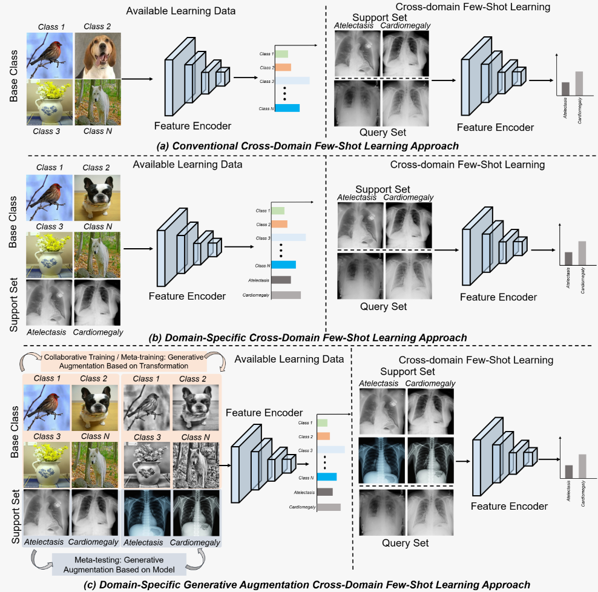
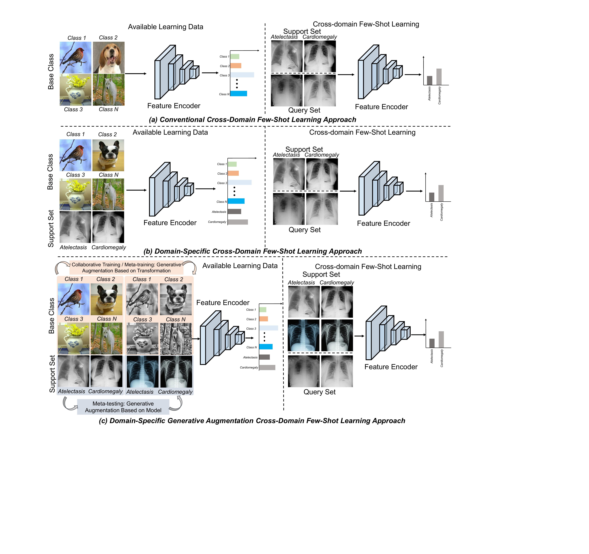

# DSGA

[简体中文说明](README_zh-CN.md)

**DSGA: Domain-Specific Generative Augmentation for Cross-Domain Few-Shot Chest X-ray Disease Recognition**

DSGA learns a source-domain representation from miniImageNet and evaluates it on
previously unseen ChestX disease classes. It combines (1) transformation-based
source augmentation, (2) four-level feature alignment, and (3) text-to-image
auxiliary support samples at meta-test time.



> **Research-use notice.** Generated images are prompt-conditioned auxiliary
> samples. They are not expert annotations, are never used as query images, and
> must not be interpreted as clinically valid radiographs or diagnostic evidence.

## What is implemented

- paper-aligned ResNet-10 with Layer1--Layer4 outputs of 64, 128, 256 and 512 dimensions;
- source transformation `grayscale -> CLAHE contrast -> Gaussian blur`;
- cross-domain collaborative training on original and transformed miniImageNet views;
- 5-way episodic meta-training with a weighted prototype loss at all four levels;
- FLUX.1 (paper default) and SDXL generation backends with per-image seeds and metadata;
- automatic technical checks plus an explicit human-review manifest for generated samples;
- image-disjoint support/query sampling and 95% confidence intervals over episodes;
- meta-testing with generated images added to **support only**;
- prototype-based Grad-CAM visualizations;
- paper figures in vector PDF and GitHub-friendly PNG formats;
- unit tests and a small CPU smoke-test configuration.

The original repository contained only text-to-image and RGB-to-X-ray-style scripts.
Those filenames remain as aliases for the new entry points, while the complete pipeline is
implemented in the `dsga/` package.

## Method in one page

### Stage 1: cross-domain collaborative training

For every miniImageNet source image `x`, DSGA constructs

```text
x_aug = blur(contrast(grayscale(x)))
```

The same encoder processes both views and minimizes
`CE(f(x), y) + CE(f(x_aug), y)`. No ChestX image is used during this stage.

### Stage 2: multi-branch episodic meta-training

Source episodes are sampled from transformed source images. ResNet-10 produces global
average-pooled embeddings from Layer1--Layer4. At every level, query embeddings are
classified against support prototypes. The loss is

```text
L = 0.100 L1 + 0.270 L2 + 0.189 L3 + 0.441 L4.
```

### Stage 3: target-domain meta-testing

Each target episode contains real ChestX support and query images. Quality-controlled,
class-conditioned FLUX.1 images may be appended to support. Prototypes and query scores
are computed at the same four levels with the same weights. Query labels are read only
after prediction to compute accuracy.



## Environment

The reference environment is Python 3.10, PyTorch 2.3.1 and CUDA 12.1. A CUDA GPU is
strongly recommended for training and required in practice for local FLUX.1 generation.

### Conda (recommended)

```bash
conda env create -f environment.yml
conda activate dsga
python -m pip install -e .
```

Install the optional generator dependencies only on the machine that will run FLUX/SDXL:

```bash
python -m pip install -r requirements-generation.txt
```

### Pip

Install a CUDA-compatible PyTorch build first if the pinned wheel does not match your
driver, then install the project:

```bash
python -m venv .venv
source .venv/bin/activate          # Windows: .venv\Scripts\activate
python -m pip install --upgrade pip
python -m pip install -r requirements.txt
python -m pip install -e .
```

Verify the setup:

```bash
python -c "import torch; print(torch.__version__, torch.cuda.is_available())"
pytest
```

## Data preparation

Data and generated medical images are intentionally excluded from Git. Follow the
dataset licenses and institutional requirements; do not publish patient data or local
absolute-path manifests.

### miniImageNet source domain

Use the standard 64/16/20 class split and place the 64 training classes in ImageFolder
layout:

```text
data/miniimagenet/train/
├── n01532829/
│   ├── image_001.jpg
│   └── ...
├── n01558993/
└── ...                         # 64 class folders, 600 images/class
```

Only `data/miniimagenet/train` is used by both training stages. The implementation also
accepts a CSV manifest with `path,label,split`; switch `data.source.folder` to `null`
and set `data.source.manifest` in `configs/dsga.yaml`.

### NIH ChestX-ray14 target domain

Obtain ChestX-ray14 from the [NIH release page](https://nihcc.app.box.com/v/ChestXray-NIHCC)
and keep `Data_Entry_2017.csv`. Build the evaluation manifest:

```bash
python prepare_chestx.py \
  --metadata /datasets/ChestX/Data_Entry_2017.csv \
  --images /datasets/ChestX/images \
  --output data/manifests/chestx.csv
```

The manuscript evaluates seven labels and reports the following evaluation-pool counts:

| Label | Images |
|---|---:|
| Atelectasis | 11,545 |
| Cardiomegaly | 2,404 |
| Effusion | 8,040 |
| Infiltration | 11,795 |
| Mass | 2,926 |
| Nodule | 3,009 |
| Pneumothorax | 2,200 |

Multi-label images may produce more than one manifest row. The episodic sampler enforces
global path uniqueness, so a physical image cannot appear in both support and query (or
twice under two labels) within one episode. For a stricter single-label subset, add
`--single-label-only`; note that this changes the paper's evaluation pool.

ChestX is loaded only by `evaluate.py`. It is not used for source training, episodic
meta-training, model selection or hyperparameter tuning.

## Generate and review auxiliary support images

The paper uses eight generated images per disease category. FLUX.1-dev is gated: accept
the model's non-commercial license on its
[model card](https://huggingface.co/black-forest-labs/FLUX.1-dev), authenticate locally,
and review the [official FLUX repository](https://github.com/black-forest-labs/flux).

```bash
huggingface-cli login
python generate_support.py \
  --backend flux \
  --model black-forest-labs/FLUX.1-dev \
  --classes ChestX.txt \
  --images-per-class 8 \
  --output data/generated \
  --cpu-offload
```

For an SDXL ablation:

```bash
python generate_support.py \
  --backend sdxl \
  --model stabilityai/stable-diffusion-xl-base-1.0 \
  --dtype float16
```

Every generated image is accompanied by its prompt, seed, model and inference settings
in `generation.jsonl`. Create the quality-control sheet:

```bash
python quality_control.py --input data/generated \
  --output data/generated/qc_manifest.csv
```

Technical checks flag invalid resolution, exposure, contrast, entropy and non-grayscale
appearance. A qualified reviewer must inspect thoracic anatomy, obvious distortions,
non-medical objects and whether the image contains a plausible disease-related pattern.
Set `accepted=true` only after review. `evaluate.py` ignores every row not explicitly
accepted. `--accept-auto` exists for engineering ablations, not for clinical validation.

Expected layout:

```text
data/generated/
├── Atelectasis/000.png ... 007.png
├── Cardiomegaly/000.png ... 007.png
├── ...
├── generation.jsonl
└── qc_manifest.csv
```

## Reproduce the experiment

All paper settings are in `configs/dsga.yaml`.

```bash
# 1. 400-epoch original/transformed source collaborative training
python train_collaborative.py --config configs/dsga.yaml

# 2. 1,200 source-domain few-shot episodes, four-level alignment
python train_meta.py --config configs/dsga.yaml

# 3. 600 target episodes for each 1/5/20/50-shot setting
python evaluate.py --config configs/dsga.yaml
```

Linux/macOS users may run `bash scripts/run_reproduction.sh`; Windows users may run
`powershell -ExecutionPolicy Bypass -File scripts/run_reproduction.ps1`.

Settings can be overridden without editing YAML:

```bash
python evaluate.py --config configs/dsga.yaml \
  --set evaluation.shots='[1]' \
  --set evaluation.generated_per_class=0 \
  --set device=cuda:1
```

`generated_per_class=1` samples one accepted image from the per-class pool and matches
the manuscript's support-size-controlled 1-shot+GA protocol. Set it to `0` for the
without-generative-augmentation ablation.

Outputs:

```text
outputs/dsga_resnet10/
├── collaborative.pt
├── meta.pt
└── evaluation.json             # mean accuracy and episode-level 95% CI
```

### CPU smoke test

This checks the entire pipeline without downloading either benchmark:

```bash
python scripts/create_smoke_data.py
python train_collaborative.py --config configs/smoke.yaml
python train_meta.py --config configs/smoke.yaml
python evaluate.py --config configs/smoke.yaml
```

Smoke-test values are functional checks only and have no scientific meaning.

### Main ablations

The component ablations can be reproduced with configuration overrides while keeping
the same sampled episodes and seed:

```bash
# no model-driven generative augmentation (GA off)
python evaluate.py --config configs/dsga.yaml --set evaluation.generated_per_class=0

# high-level branch only (multi-branch alignment off in training and testing)
python train_meta.py --config configs/dsga.yaml --set model.layer_weights='[0,0,0,1]'
python evaluate.py --config configs/dsga.yaml --set model.layer_weights='[0,0,0,1]'

# no transformation-based collaborative contribution
python train_collaborative.py --config configs/dsga.yaml \
  --set collaborative.augmented_loss_weight=0
```

Use separate `output_dir` values for every ablation so checkpoints cannot overwrite the
full model. When a training-stage component changes, retrain all downstream stages.

## Visualization

Create the three-panel query/heatmap/overlay figure used for interpretability analysis:

```bash
python visualize_attention.py \
  --checkpoint outputs/dsga_resnet10/meta.pt \
  --query /datasets/ChestX/images/query.png \
  --support-dir data/generated/Atelectasis \
  --output outputs/atelectasis_gradcam.png
```

The score differentiated by Grad-CAM is cosine similarity between the real query and
the supplied class prototype. Use real and/or accepted auxiliary images in the support
folder, and state that composition in the figure caption.

Paper-ready source figures are in `assets/paper_figures/`: use PDF files for LaTeX and
PNG files for GitHub/web pages.

| Figure asset | Suggested use |
|---|---|
| `First.pdf` | comparison of conventional, domain-specific and DSGA protocols |
| `Frame.pdf` | complete DSGA framework |
| `Method1.pdf` | collaborative training |
| `Method2.pdf` | multi-branch meta-training |
| `Method3.pdf` | multi-branch meta-testing |
| `Example1.pdf` | transformation examples |
| `Example2.pdf` | real ChestX examples |
| `Gene.pdf` | FLUX.1/SDXL generation examples |
| `Visu.pdf` | interpretability examples |

## Reported manuscript results

These are values reported in the accompanying manuscript, not results fabricated by
this repository and not a promise that a different dataset copy, generated-image pool
or software stack will reproduce identical numbers.

| Setting | Accuracy (95% CI) |
|---|---:|
| 5-way 1-shot | 24.89% +/- 0.66% |
| 5-way 5-shot | 28.24% +/- 0.64% |
| 5-way 20-shot | 36.12% +/- 0.65% |
| 5-way 50-shot | 38.85% +/- 0.68% |

For defensible comparisons, archive the YAML file, checkpoint, ChestX manifest, generated
metadata, reviewed QC manifest, random seed and `evaluation.json` for every run.

## Repository structure

```text
DSGA/
├── configs/                    # paper and smoke-test settings
├── dsga/
│   ├── augmentation.py         # grayscale/CLAHE/Gaussian transformation
│   ├── data.py                 # manifests, ImageFolder and disjoint episodes
│   ├── generation.py           # FLUX.1 and SDXL inference
│   ├── models.py               # four-branch ResNet-10
│   ├── pipeline.py             # training, meta-training and evaluation
│   ├── prototypical.py         # prototypes, similarities and weighted loss
│   ├── quality.py              # generated-image QC manifest
│   └── visualize.py            # prototype Grad-CAM
├── assets/paper_figures/       # PDF originals and PNG previews
├── tests/
├── train_collaborative.py
├── train_meta.py
├── generate_support.py
├── quality_control.py
├── evaluate.py
└── visualize_attention.py
```

## Common issues

- **CUDA out of memory during FLUX.1:** use `--cpu-offload`, reduce width/height, or run
  generation on a separate high-memory GPU. Generation is offline; training does not
  load the diffusion model.
- **No accepted generated images:** inspect and edit `qc_manifest.csv`. Evaluation fails
  loudly instead of silently using rejected images.
- **Windows DataLoader stalls:** set `collaborative.workers=0`.
- **A class has too few images:** reduce `shots`/`queries` or correct the manifest. The
  sampler will not reuse an image to make an invalid episode fit.
- **Exact accuracy differs:** verify split definitions, multi-label policy, accepted
  generation pool, seeds, model version and layer weights before changing optimization.

## Citation

```bibtex
@article{wu2026dsga,
  title   = {DSGA: Domain-Specific Generative Augmentation for Cross-Domain
             Few-Shot Chest X-ray Disease Recognition},
  author  = {Wu, Heng and Zheng, Zijun and Wang, Wansong and Lv, Laishui and
             Bardou, Dalal and Yu, Gaohang},
  year    = {2026}
}
```

